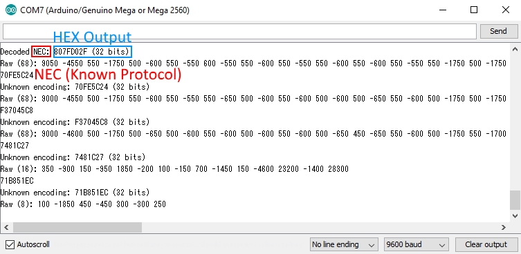
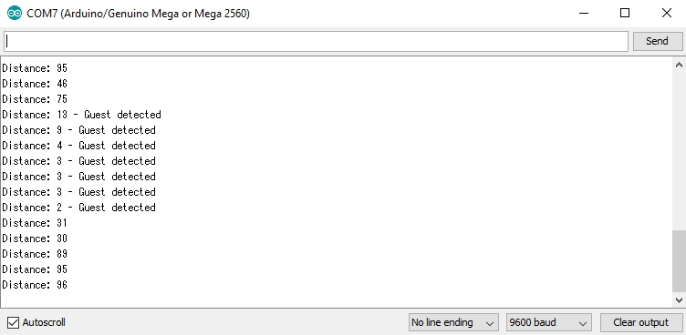
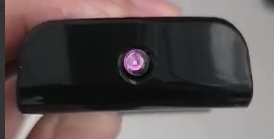

# Motion-Activated TV Remote with Arduino

## Introduction

This is part of a project to help add Quality of Life features to my workplace. The idea was to make a TV that would turn on and play a corporate video when motion was detected. This was to allow visitors to automatically get an introduction to the company while still saving power during non-visiting hours of the day. An Arduino MEGA 2560 was used for the prototype, though a normal Arduino UNO or Mini would be sufficient. The module can be mounted behind a door with a clear sight to a television such that the opening of the door would trigger the television.

The module uses the ultrasound sensor to detect the door swinging towards it. This then triggers the IR commands to be sent to the TV. An optional 4-digit display can also be used to allow for on-site debugging of the ultrasound sensor output without a computer.

### Components Used:

- Arduino MEGA 2560
- Waitrony IE-0530HP IR LED
- Open Smart Infrared Receiver v1.1
- Ultrasound Sensor HC-SR04
- TM1637 4-digit Display Board (optional)

## Wiring the Components

Wire everything up like this:


Most of the pins can be changed except for the signal pin of the IR emitter. The IR emitter will use PWM_TIMER_2 by default on the Arduino. This means that the actual pin would vary from Arduino model to Arduino model. In the case of the Uno, the pin would be pin 3 while in the case of the Mega, it would be pin 9. Later on, after installing the IRremote library, it is possible to nagivate to the IRremote library header file - *RobotIRremoteInt.h* (default drive: C:\Program Files (x86)\Arduino\libraries\RobotIRremote) get the full list of the timers and their. The user can also change which timer (and thus which pin) they would like to use.

```c++
// Arduino Mega
#if defined(__AVR_ATmega1280__) || defined(__AVR_ATmega2560__)
  //#define IR_USE_TIMER1   // tx = pin 11
  #define IR_USE_TIMER2     // tx = pin 9
  //#define IR_USE_TIMER3   // tx = pin 5
  //#define IR_USE_TIMER4   // tx = pin 6
  //#define IR_USE_TIMER5   // tx = pin 46

// Teensy 1.0
#elif defined(__AVR_AT90USB162__)
  #define IR_USE_TIMER1     // tx = pin 17

// Teensy 2.0
#elif defined(__AVR_ATmega32U4__)
  //#define IR_USE_TIMER1   // tx = pin 14
  //#define IR_USE_TIMER3   // tx = pin 9
  #define IR_USE_TIMER4_HS  // tx = pin 10

// Teensy++ 1.0 & 2.0
#elif defined(__AVR_AT90USB646__) || defined(__AVR_AT90USB1286__)
  //#define IR_USE_TIMER1   // tx = pin 25
  #define IR_USE_TIMER2     // tx = pin 1
  //#define IR_USE_TIMER3   // tx = pin 16

// Sanguino
#elif defined(__AVR_ATmega644P__) || defined(__AVR_ATmega644__)
  //#define IR_USE_TIMER1   // tx = pin 13
  #define IR_USE_TIMER2     // tx = pin 14

// Atmega8
#elif defined(__AVR_ATmega8P__) || defined(__AVR_ATmega8__)
  #define IR_USE_TIMER1   // tx = pin 9

// Arduino Duemilanove, Diecimila, LilyPad, Mini, Fio, etc
#else
  //#define IR_USE_TIMER1   // tx = pin 9
  #define IR_USE_TIMER2     // tx = pin 3
```

For the IR emitter, the Waitrony IE-0530HP was used and connected directly to the emitter pin and ground. 

### IR Detection

Before we can send the IR signals to the TV, we have to receive the IR signals that correspond to their specific buttons. This is so that we can emulate the signal afterwards for our TV control purposes. 

We'll be using the IRremote library.

```c++
#include <IRremote.h>
```

You can find the IRremote library [here](https://github.com/z3t0/Arduino-IRremote).

We'll be using the IRrecvDump.ino example code from the IRremote library to detect our IR signals. Simply change this line of code:

```c++
int RECV_PIN = 11;
```

To be whatever pin the signal end of the receiver is connected to (in our case, the pin would be 12). Alternatively, the edited .ino file can also be found here.

Upload the code  (ctrl+U) and start the serial monitor (ctrl+shift+M). Then using the remote of your choice, press a button to get the corresponding output in HEX. The code will also detect if the remote control IR output is following a specific protocol. It is best if you use a TV remote that follows one of the protocols as it would make emulating the output more reliable.

This section of code is what determines the type of signal being decoded. If the output is Unknown, we should refrain from using that make and model of television for the project. This is because to emulate an unknown protocol, we would have to emulate the raw sensor data - this is much more unreliable and subject to factors such as sensor reliability and the clock speed of the Arduino (which might give us incorrect readings to emulate).

``` c++
void HEXdecode(decode_results *results) {
  int count = results->rawlen;
  // Sorts out what sort of encoding is used
  if (results->decode_type == UNKNOWN) {
    Serial.print("Unknown: ");
  } else if (results->decode_type == NEC) {
    Serial.print("NEC: ");
  } else if (results->decode_type == SONY) {
    Serial.print("SONY: ");
  } else if (results->decode_type == RC5) {
    Serial.print("RC5: ");
  } else if (results->decode_type == RC6) {
    Serial.print("RC6: ");
  } else if (results->decode_type == PANASONIC) {
    Serial.print("PANASONIC: ");
    Serial.print(results->address, HEX);
    Serial.print(" Value: ");
  } else if (results->decode_type == LG) {
    Serial.print("LG: ");
  } else if (results->decode_type == JVC) {
    Serial.print("JVC: ");
  } else if (results->decode_type == AIWA_RC_T501) {
    Serial.print("AIWA_RC_T501: ");
  } else if (results->decode_type == WHYNTER) {
    Serial.print("WHYNTER: ");
  }
  Serial.print(results->value, HEX);
  Serial.println(" ");
}
```

After pressing a button, you will get the corresponding output. We are mainly concerned with getting the HEX output of a known protocol. This would make it much easier to emulate the IR signal later. 



Record the HEX output and protocol to the corresponding button, you should eventually get a notepad file of values like these (in this case, the values were for a Mistral Fan remote control because I was using it as a test bed for IR module).

``` c++
These values are in NEC Format
Power: 807FD02F
Timer: 807FF00F
Speed: 807FE01F
Breeze: 807FC03F
Swing: 70FE5C24
```

With these values obtained, we can move on to the actual control code in the final version of the project.

## Code

### Libraries

We'll be using the TM1637 and the IRremote libraries. The TM1637 library is optional if you do not wish to use the 4-digit diplay.

``` c++
#include <TM1637.h>
#include <IRremote.h>
```

You can find the TM1637 library [here](https://github.com/reeedstudio/libraries/blob/master/DigitalTube/TM1637.h) and the IRremote library [here](https://github.com/z3t0/Arduino-IRremote).

### User Defined Variables

Next we have the user defined variables for the pins:

```c++
// ULTRASOUND PINS
const int trigPin = 11;
const int echoPin = 10;
// INFRARED LED PINS
const int LEDPin = 6;
// THRESHOLD DISTANCE FOR DETECTION
const int detectionDistance = 20;
// LED DISPLAY PINS
const int clk_pin = 7;
const int dio_pin = 8;
// ENABLE DEBUG PRINTS
const bool debug_prints = true;
const bool LED_Display_print = true;
```

Perhaps the most important definition here is the detectionDistance. This the threshold distance at which the program will "detect" that a guest is present. Feel free to calibrate the sensor sensitivity as needed with this variable. The user can also decide if they would like serial debug prints and/or the LED display to show the distance value. These two are kept separate in case the user would like to have the option of having one without the other.

Notice that there is no pin definition for the IR emitter. This is because the IRremote library defaults the emitter to PWM pin 3.

Next is the initialization of the IRsend object and the TM1637:

```c++
// IR SEND
#include <IRremote.h>
IRsend irsend;
// TM1637 initialization
TM1637 tm1637(clk_pin, dio_pin);
```

Next up we have the User Defined Functions - these set the subroutine the program would execute when a guest is detected. It is essentially a set of IR commands sent from the transmitter:

Below a specific value, the program would trigger the IRblast() function, which is a user defined set of IR commands. These IR specific commands can be found at the top under user defined functions.

```c++
// ============================== USER DEFINED FUNCTIONS ==================================
// This is the IRblast function that contains the full sequence of IR commands to send to the device
void IRblast() {
  buttonOn();
}

// On button IR burst
void buttonOn() {
  irsend.sendNEC(0x807fd02f, 32); // Change this HEX value as necessary
  delay(40);
}
// =========================================================================================
```

The IRblast() function contains the full sequence of IR commands the Arduino would output to control the device.

Various button functions can be found and customized based on the HEX values obtained from the IR detection process. These functions can then be nested within the IRblast() function.

This is followed by the definition of variables used internally by the program:

``` c++
long duration;
int distance;
// Whether a guest is detected
bool guest_detected = false;
```

Duration will be used for storing the time taken for the ultrasound to rebound and return back to the ultrasound sensor. Distance will be used to store the final calculated distance of the object. The guest_detected variable will be used to command the program to execute the IR emitting code if a guest has been detected.

Under the setup function, we initialize the pins and set the brightness for the TM1637:

```c++
void setup() {
  pinMode(trigPin, OUTPUT); // Sets the trigPin as an OUTPUT
  pinMode(echoPin, INPUT); // Sets the echoPin as an INPUT
  pinMode(LEDPin, OUTPUT); // Sets the LEDPin as an OUTPUT
  // INITIALIZE THE LED DISPLAY
  // BRIGHT_TYPICAL = 2,BRIGHT_DARKEST = 0,BRIGHTEST = 7;
  tm1637.init();
  tm1637.set(BRIGHT_TYPICAL);
  Serial.begin(9600); // Starts the serial communication
}
```

Under the loop function, we attach the value of ultrasound() to a new variable, distanceV.

```c++
void loop() {
  // Create new distance variable and set it to the output of the ultrasound function
  int distanceV = ultrasound();
```

The ultrasound function code can be found at the bottom of the code:

```c++
int ultrasound() {
    // CLEAR THE TRIG PIN
  digitalWrite(trigPin, LOW);
  delayMicroseconds(2);
  // ULTRASOUND BURST
  digitalWrite(trigPin, HIGH);
  delayMicroseconds(10);
  digitalWrite(trigPin, LOW);
  // READS THE REBOUNDED BURST
  duration = pulseIn(echoPin, HIGH);
    // Calculating the distance
  distance= duration*0.034/2;
  // Set Distance to a meaningful cap
  if (distance > 450) {
    distance = 450;
  }
  return distance;
}
```

There is not much to explain here except that we calculate the distance by using duration and multiplying it by the speed of sound to get the distance. However we also divide the value by 2 because the sound has travelled twice the distance (travel to the object and then bounce back). It then outputs the value and passes it to distanceV in the main loop function. Feel free to also define the cap on the distance as you see fit. 

Next up in the main loop function is the guest detection logic and subsequent IR blasting:

```C++
// Guest Detection 
  if (distanceV < detectionDistance) {
  guest_detected = true;
  } else {
  guest_detected = false;
  }

  if (guest_detected) {
      IRblast();
  }
```

This just compares the distance to that of the threshold value set by the user at the start of the program. If the distance is low enough (AKA the door has been opened and swings towards the sensor), the IRblast() function would be called, which contains the set of user-defined IR commands.

Finally, we have the debug prints at the end of the program:

```c++
// ================================ DEBUG PRINTS ====================================
  if (debug_prints) {
    Serial.print("Distance: ");
    Serial.print(distanceV);
    if (guest_detected) {
      Serial.println(" - Guest detected");
    } else {
      Serial.println("\t");
    }
  }
  if (LED_Display_print) {
    displayDistance(distanceV);
  }
// ==================================================================================
```

The serial monitor would output the distance as well as whether the guest is detected. It would appear like this:



The debug print section also include the LED Display for the TM1637. It calls the displayDistance function, which can be found at the bottom of the code:

```c++
// TM1637 DISPLAY FUNCTION
void displayDistance(int distanceV) {
  // CONVERTS distance int value into an array
  int distanceValueArray[4];
  for (int i = 3; i >= 0; i--) {
    distanceValueArray[i] = distanceV % 10;
    distanceV /= 10;
  }
  // DISPLAY PRINTS
  tm1637.display(0,distanceValueArray[0]);
  tm1637.display(1,distanceValueArray[1]);
  tm1637.display(2,distanceValueArray[2]);
  tm1637.display(3,distanceValueArray[3]);
}
```

The displayDistance function converts the integer value give to it (max 4 digits) into an array of 4 digits. This allows the array to then be assigned to the individuals digit displays of the TM1637 to be shown. 

## Troubleshooting

#### [30/08/18] 

With regards to the setup, I have wired everything correctly and did the following:

- Tested the motion sensor and output with Serial Monitor
- Got the TM1637 to display the ultrasound distance value
- Verified that the receiver is working and obtained IR values from a Mistral fan remote

However, I have ran into an issue which is that the IR emitter is not working. I have tried the following steps:

- Direct connection of the power source to the IR LED on the emitter - does not work
- Using digitalWrite to output a HIGH signal directly to the IR emitter board - does not work

Using a phone camera, I was able to ascertain that a purplish glow can be found emanating from active IR LEDs (like that of the Mistral fan remote), but I was unable to get a similar response. My conclusion is that the IR LED might be malfunctioning. I would attempt to get a replacement soon.



Above is what the IR LED of the Mistral fan remote looked when under a phone camera.

#### [31/08/18]

I have procured a new Open Smart IR emitter and tried the following:

- Tested the IR emitter using IRremote library on pin 3 - IR LED does not light up
- Tested the IR emitter using IRlib2 library on pin 3 - IR LED does not light up
- Tested the IR emitter on the board directly with a 5V power source - IR LED does not light up
- Bought a new open smart IR emitter board and tested with IRremote library on pin 3 - IR LED does not light up
- Directly tested the emitter diode on the new board - IR LED does not light up
- Tested digitalWrite HIGH on PWM pin 4 and digital pin 24 directly for both new and old sensors - they both do not work
- Directly tested an unsoldered IR LED using 470ohms resistor and transistor to raw 5V power source on arduino - IR LED lights up faintly

I am now considering creating my own IR LED circuit using a simple 470ohms resistor and a transistor. 

#### [02/09/18] ####

I have learnt that the IR pin isn't default to pin 3. It actually uses PWM_TIMER_2, which for most tutorials, just happens to be pin 3 on the Arduino Uno. What they failed to mention was that the timer 2 pin on the Arduino Mega was actually pin 9. Accessing the *RobotIRremoteInt.h* file in the IRremote library, I found the full list of timers and their pin numbers as well as options to uncomment whichever timer the user would like to use.

Using an oscilloscope, I confirmed that there was indeed a signal being sent on pin 9 of the Arduno Mega, however the signal strength was too weak. This I ditched the Open Smart IR emitter in favor of a Waitrony IE-0530HP IR LED directly connected to the signal pin and ground.

#### [03/09/18]

Tested on the Mistral fan and got it to turn on, swing, stop swinging and then turn off. I'd consider this a successful test trial. Now on to testing the IR codes of TVs in a TV store.

